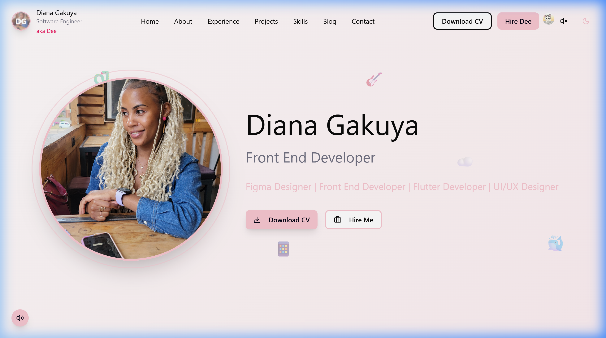
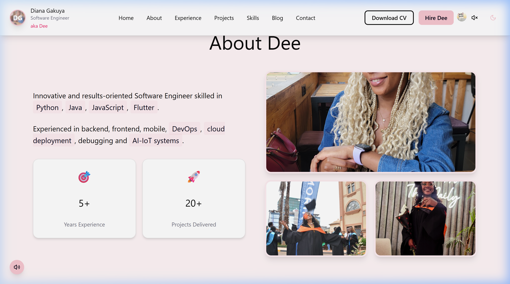
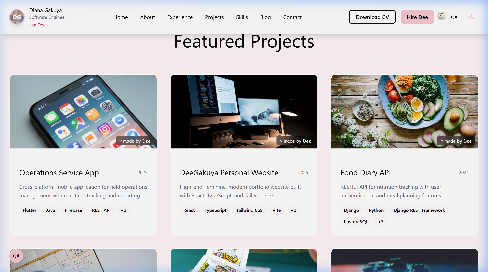
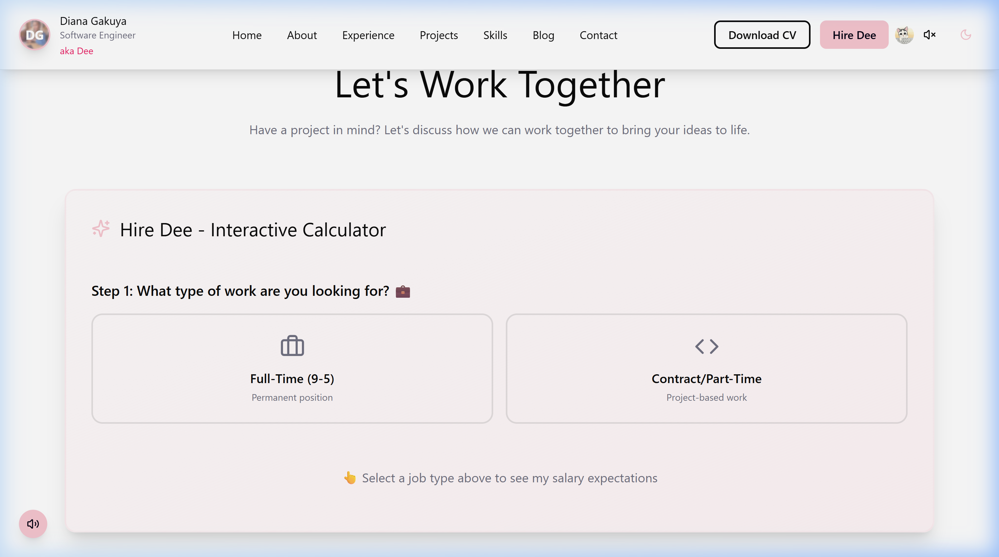

# Diana Gakuya - Software Engineer Portfolio

Welcome to my personal portfolio website! This repository houses the source code for my interactive CV and portfolio site, designed to showcase my software engineering background, key achievements, project work, and skills.

## 🚀 Live Demo & Features

The website is a highly responsive, modern single-page portfolio built with **React**, **Vite**, and **Tailwind CSS**. It includes:
- **Rich Dark/Light Mode Theme toggling** for comfortable reading.
- **Interactive Project Cost Calculator** ("Hire Dee Calculator") for estimating project budgets dynamically.
- **Dynamic Monogram & Logo** with customized styling.
- **Unified Navigation & PDF Resume downloader** linking to my updated CV.
- **GitHub API Integration** to dynamically fetch and display my latest repositories.
- **Interactive Photo Gallery** showing my workspace and graduation vibes.

---

## 📸 Screenshots

Here is a visual walk-through of the interface:

### 🏠 Hero Section
*Clean, interactive home layout with a typing animation displaying my roles and floaty technology icons.*


### 👩‍💻 About Me
*A summary of my engineering background, career philosophy, and highlight pictures.*


### 📂 Projects & GitHub Integration
*List of featured projects and live repositories loaded dynamically using the GitHub API.*


### ✉️ Contact & Hire Dee Calculator
*Budget calculator for potential clients, contact details, and a form to drop a message.*


---

## 🛠️ Technology Stack

- **Core Framework**: React 18 & TypeScript
- **Styling**: Tailwind CSS & Radix UI primitives
- **Icons**: Lucide React
- **Dev Tooling**: Vite 6 (extremely fast HMR)
- **Dependencies**: React Day Picker, Recharts, Sonner (Toasts), Embla Carousel

---

## 💻 Running the Code Locally

### 1. Prerequisites
Ensure you have [Node.js](https://nodejs.org/) installed.

### 2. Install Dependencies
Run the package installation:
```bash
npm install
```

### 3. Run Development Server
Start the local server:
```bash
npm run dev
```
Open your browser and navigate to **[http://localhost:3000](http://localhost:3000)** (or the port specified in your terminal).

### 4. Build for Production
To generate the production-ready build:
```bash
npm run build
```
The compiled build output will be located in the `build/` directory.